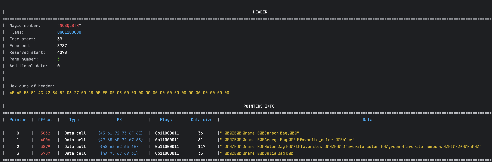

# NeverSQL

[](https://github.com/nrupprecht/NeverSQL/actions/workflows/cmake-build-and-test-platform.yml)

A small, simple no-SQL database implemented in C++. 

As this is a project for learning and demonstrating principles (and a work in progress), and is not
intended for production use.

## Structure

The most basic layer is the data access layer, which is responsible for reading and writing data to persistent memory. 
This is managed by the DataAccessLayer class. The DataAccessLayer class manages memory pages, and provides an interface
to request pages, free previously requested pages, and write pages back to persistent memory after applications have 
modified the page data.

## Other tools

The project includes some basic functionality to do a hex dump of a file or stream. This can be useful for debugging
purposes. This is implemented in [NeverSQL/utility/HexDump.h](include/NeverSQL/utility/hexdump.h)
and [NeverSQL/utility/HexDump.cpp](source/NeverSQL/utility/HexDump.cpp).


The DataManager has a method to do a hex dump of a page, which can be used like

```C++
// Assuming that page 2 is valid. 
// This is a safe assumption since pages 0, 1, and 2 are always created when the DB is created.
manager.HexDumpPage(2, std::cout);
```

There is also a tool to do an analysis of a BTree page node. This is implemented
in [NeverSQL/utility/PageDump.h](include/NeverSQL/utility/PageDump.h)
and [NeverSQL/utility/PageDump.cpp](source/NeverSQL/utility/PageDump.cpp).



The DataManager class can use this function to dump nodes, it can be called like this (assuming the page referenced is
part of a BTree):

```C++
neversql::DataManager manager(database_path);
// Assuming that page 3 holds a BTree node.
manager.NodeDumpPage(3, std::cout);
```

## Notes

Some useful resources on databases and database implementations:
* SQLite
  * Database format: https://sqlite.org/fileformat.html
  * Write ahead log: https://sqlite.org/wal.html
* Slotted pages:
    * https://siemens.blog/posts/database-page-layout/
* PostgreSQL
  * Internals: https://www.postgresql.org/docs/current/internals.html
    * btree: https://www.postgresql.org/docs/current/btree-behavior.html
    * Data layout: https://www.postgresql.org/docs/current/storage-page-layout.html
  * ["The Internals of Postgres"](https://www.interdb.jp/pg/index.html)
* BSON spec: https://bsonspec.org/, https://bsonspec.org/spec.html
* Other tutorials / similar projects
  * https://cstack.github.io/db_tutorial/
  * https://adambcomer.com/blog/simple-database/motivation-design/
  * https://betterprogramming.pub/build-a-nosql-database-from-the-scratch-in-1000-lines-of-code-8ed1c15ed924

# Building and installing

See the [BUILDING](BUILDING.md) document.

# Contributing

See the [CONTRIBUTING](CONTRIBUTING.md) document.

# Licensing

<!--
Please go to https://choosealicense.com/licenses/ and choose a license that
fits your needs. The recommended license for a project of this type is the
Boost Software License 1.0.
-->
