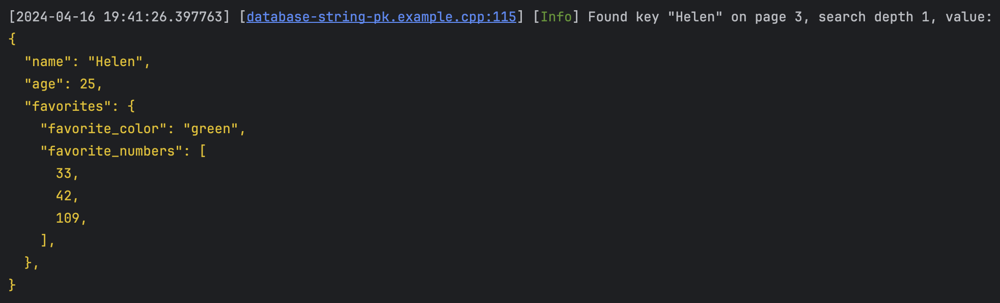
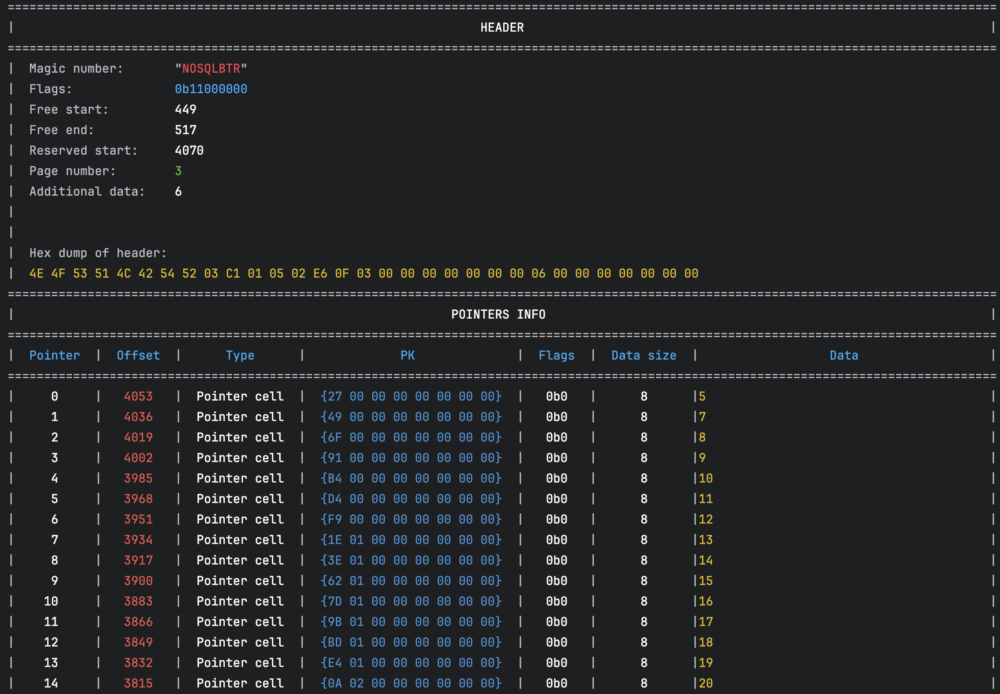

# NeverSQL

[](https://github.com/nrupprecht/NeverSQL/actions/workflows/bazel-multi-platform.yml.yml)

A small, simple no-SQL database implemented in C++. 

As this is a project for learning and demonstrating principles (and a work in progress), and is not
intended for production use.

## Basic useage

NeverSQL is a document based database, where each document is a JSON, or JSON-like object. NeverSQL has
a [Document](neversql/data/Document.h) class
that can be use to construct documents, one field at a time. This class is also used to add documents to the Database.

```c++
neversql::Document helen_document;
helen_document.AddElement("name", neversql::StringValue{"Helen"});
helen_document.AddElement("age", neversql::IntegralValue{25});

// Sub-document.
{
  auto sub_builder = std::make_unique<neversql::Document>();
  sub_builder->AddElement("favorite_color", neversql::StringValue{"green"});

  auto array = std::make_unique<neversql::ArrayValue>(neversql::DataTypeEnum::Int32);
  array->AddElement(neversql::IntegralValue{33});
  array->AddElement(neversql::IntegralValue{42});
  array->AddElement(neversql::IntegralValue{109});
  sub_builder->AddElement("favorite_numbers", std::move(array));
  helen_document.AddElement("favorites", std::move(sub_builder));
}
```

### DataManager

Currently, the "highest level" interface to the database is the [DataManager](neversql/DataManager.h) class.
This is fairly low level in that it does not do things like parse queries, it manages the storage and retrieval of 
documents. It can also create new "collections" of documents, analogous to tables in a relational database.
```c++
// ---> Your database path here.
std::filesystem::path database_path = "path-to-database-directory";

// Creates or loads the database.
neversql::DataManager manager(database_path);

// Add a collection to the database called "elements" that uses strings as the primary key.
manager.AddCollection("elements", neversql::DataTypeEnum::String);
```

You can then add documents to the collection like this:
```c++
// Add the document to the "elements" collection. We use the string "Helen" as the primary key.
std::string key = "Helen";
manager.AddValue("elements", neversql::internal::SpanValue(key), helen_document);
```

A document can be retrieved from a collection
```c++
auto result = manager.Retrieve("elements", neversql::internal::SpanValue(key));
if (result.IsFound()) {
  // Interpret the data as a document.
  auto document = EntryToDocument(*result.entry);

  LOG_SEV(Info) << formatting::Format(
      "Found key {:?} on page {:L}, search depth {}, value: \n{@BYELLOW}{}{@RESET}",
      name,
      result.search_result.node->GetPageNumber(),
      result.search_result.GetSearchDepth(),
      neversql::PrettyPrint(*document));
}
else {
  LOG_SEV(Info) << formatting::Format("{@BRED}Key {:?} was not found.{@RESET}", name);
}
```
which should result in the document being found and printed to the console.


### Query iterators

Query iterators can be used to traverse the entire collection of documents, only counting those that satisfy a predicate.
```c++
// Execute a query: only returns documents with a field "age" less than or equal to 40.
auto iterator = neversql::query::BTreeQueryIterator(manager.Begin("elements"),
                                                    neversql::query::LessEqual<int>("age", 40));
for (; !iterator.IsEnd(); ++iterator) {
  auto entry = *iterator;
  // Interpret the data as a document.
  auto document = EntryToDocument(*entry);
  LOG_SEV(Info) << "Found: " << neversql::PrettyPrint(*document);
}
```

## Structure

See [Architecture.md](Architecture.md) for a high-level overview of the architecture.

## Other tools

The project includes some basic functionality to do a hex dump of a file or stream. This can be useful for debugging
purposes. This is implemented in [neversql/utility/HexDump.h](neversql/utility/hexdump.h)
and [neversql/utility/HexDump.cpp](neversql/utility/HexDump.cpp).


The DataManager has a method to do a hex dump of a page, which can be used like

```C++
// Assuming that page 2 is valid. 
// This is a safe assumption since pages 0, 1, and 2 are always created when the DB is created.
manager.HexDumpPage(2, std::cout);
```

It can also do a page dump of one of its pages.
```C++
// Assuming that page 2 is valid.
manager.NodeDumpPage(2, std::cout);
```

There is also a tool to do an analysis of a BTree page node. This is implemented
in [neversql/utility/PageDump.h](neversql/utility/PageDump.h)
and [neversql/utility/PageDump.cpp](neversql/utility/PageDump.cpp).

For example, a data page (leaf, or the root when it has no children) will look like this:


and a pointers (interior node or root when it has child pages) page will look like this


The DataManager class can use this function to dump nodes, it can be called like this (assuming the page referenced is
part of a BTree):

```C++
neversql::DataManager manager(database_path);
// Assuming that page 3 holds a BTree node.
manager.NodeDumpPage(3, std::cout);
```

## Notes

Some useful resources on databases and database implementations:
* SQLite
  * Database format: https://sqlite.org/fileformat.html
  * Write ahead log: https://sqlite.org/wal.html
* Slotted pages:
    * https://siemens.blog/posts/database-page-layout/
* PostgreSQL
  * Internals: https://www.postgresql.org/docs/current/internals.html
    * btree: https://www.postgresql.org/docs/current/btree-behavior.html
    * Data layout: https://www.postgresql.org/docs/current/storage-page-layout.html
  * ["The Internals of Postgres"](https://www.interdb.jp/pg/index.html)
* Mongodb
  * https://github.com/mongodb/mongo
  * BSON spec: https://bsonspec.org/, https://bsonspec.org/spec.html
* WiredTiger
  * https://source.wiredtiger.com/11.2.0/arch-index.html
* Other tutorials / similar projects
  * https://cstack.github.io/db_tutorial/
  * https://adambcomer.com/blog/simple-database/motivation-design/
  * https://betterprogramming.pub/build-a-nosql-database-from-the-scratch-in-1000-lines-of-code-8ed1c15ed924

# Building and installing

See the [BUILDING](BUILDING.md) document.

# Contributing

See the [CONTRIBUTING](CONTRIBUTING.md) document.

# Licensing

<!--
Please go to https://choosealicense.com/licenses/ and choose a license that
fits your needs. The recommended license for a project of this type is the
Boost Software License 1.0.
-->
